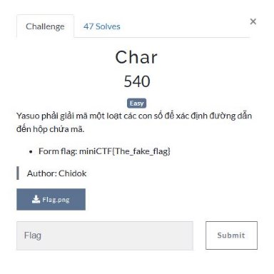
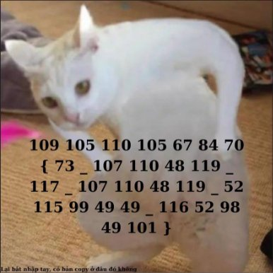
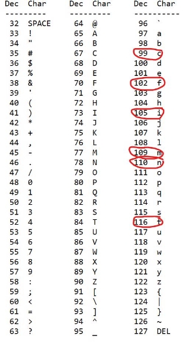

Char 

PROBLEM: 

Tải file Flag.png và mở lên. 

SOLUTION: 

- Lấy các giá trị trong bức ảnh ra: 109 105 110 105 67 84 70 { 73 \_ 107 110 48 119 \_ 117 \_ 107 110 48 119 \_ 52 115 99 49 49 \_ 116 52 98 49 101 } 
- Quan sát các giá trị gần giống với mã Ascii, ta thử sử dụng Ascii table 

- Mã hóa 6 kí tự đầu ta thấy đúng hướng ra được form Flag là miniCTF 
- Tiếp tục mã hóa theo bảng Ascii các kí tự còn lại ra được flag: miniCTF{I\_kn0w\_u\_kn0w\_4sc11\_t4b1e} 
