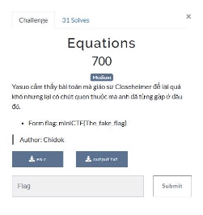
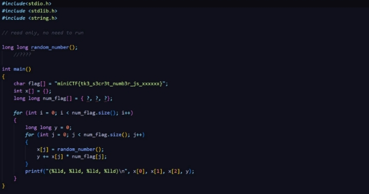

Equations 

PROBLEM: 

File: en.c 

File: output.txt 

SOLUTION: 

- Sau khi sub thử flag có trong file thấy sai => dự đoán flag còn bị thiếu một đoạn mã số thay vào cụm ‘xxxxxx’ 
- Mảng num\_flag[] chứa 3 số, có thể 1 trong 3 số là giá trị còn ẩn của flag 
- Dựa vào đoạn mã hóa:  
- Với mỗi vòng lặp i: 
- Giá trị của y đều bằng 0 
- Vòng lặp j lặp lại 3 lần (là kích thước của num\_flag[]) 
- Mỗi lần j lặp lại thì giá trị x[j] nhận 1 giá trị khác nhau 
- Giá trị của y được tăng thêm 1 phần là x[j] \* num\_flag[j]; 
- Có vẻ khó hiêu, ta thử biểu diễn dưới dạng toán học xem sao:  

- X[j] nhận các giá trị bất kì và có thể biết các giá trị đấy trong file output.txt 
- Dựa vào bảng giá trị ta có thể hình dung ra được cách chương trình hoạt động: 
- x[j = 0] \* num\_flag[0]   + x[j = 1] \* num\_flag[1]   + x[j = 2] \* num\_flag[2]   = y [Vòng for i thứ nhất với i = 0] 
- x'[j = 0] \* num\_flag[0]  + x'[j = 1] \* num\_flag[1]  + x'[j = 2] \* num\_flag[2]  = y' [Vòng for i thứ hai với i = 1] 
- x''[j = 0] \* num\_flag[0] + x''[j = 1] \* num\_flag[1] + x''[j = 2] \* num\_flag[2] = y'' [Vòng for i thứ ba với i = 2] 
- Các giá trị được bôi đỏ nằm trong file ouput.txt, nhìn đã rất quen thuộc r, đây là giải hệ phương trình 3 ẩn là 3 giá trị của num\_flag[] 
- Giải hệ phương trình được num\_flag[] = {911429, 1234567, 7654321}, giá trị thiếu trong flag tương ứng với 6 kí tự ‘x’  
- Flag: miniCTF{tk3\_s3cr3t\_numb3r\_js\_911429} 
