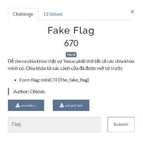
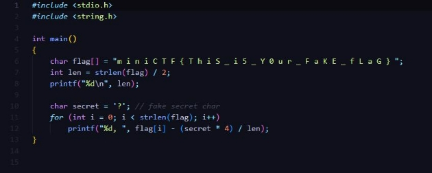
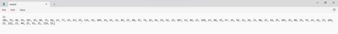
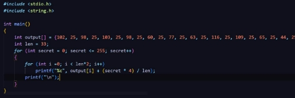
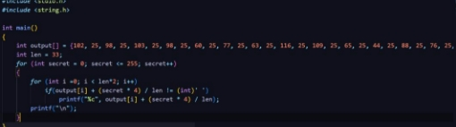

Fake Flag 

PROBLEM: 

File: encode.c

File: output.txt

Các giá trị trong file:  33 

102, 25, 98, 25, 103, 25, 98, 25, 60, 25, 77, 25, 63, 25, 116, 25, 109, 25, 65, 25, 44, 25, 88, 25, 76, 25, 44, 25, 92, 25, 107, 25, 44, 25, 109, 25, 88, 25, 97, 25, 58, 25, 29, 25, 88, 25, 49, 25, 103, 25, 88, 25, 76, 25, 41, 25, 101, 25, 111, 25, 44, 25, 93, 25, 118, 25, 

SOLUTION: 

1. Đọc file encode.c 
   1. Chuỗi flag[] bao gồm các kí tự flag cách nhau bởi một dấu cách 
   1. Biến len là chiều dài thực tế của flag thực. 
   1. Vòng For đưa ra một output.txt là mã hóa của từng kí tự trong chuỗi flag[] 
1. Phân tích phương pháp mã hóa (flag[i] - (secret \* 4) / len) 
   1. Lấy từng kí tự trong chuỗi flag[] (theo giá trị bảng Ascii) trừ đi giá trị X với X = (secret \* 4) / len 
   1. Nhận định số X là một số xác định, từ đây ta có 2 cách để tìm ngươci lại flag[i] từ file output.txt: brute-force giá trị của secret hoặc shift-cipher 
1. Brute-force 
- Ta có giá trị của biến len = 33, giá trị của flag[i] - (secret \* 4) / len trong file output.txt 
- Nên ta có công thức tìm lại flag[i] = các giá trị trong file output + (secret \* 4) / len 
- Với từng giá trị của biến secret ta có 1 giá trị của flag[i] => chuỗi flag 

- (Mảng output gồm các giá trị của flag[i] trong file output.txt) 
- Sau khi chạy ra được các giá trị có khả năng của chuỗi flag[] tìm đc flag là 

m i n i C T F { t H 3 \_ S 3 c r 3 t \_ h A $ \_ 8 n \_ S 0 l v 3 d } 

- Thấy flag còn dấu cách, ta sửa code một chút để loại bỏ dấu cách để submit

- Chạy xong được flag: miniCTF{tH3\_S3cr3t\_hA$\_8n\_S0lv3d} 
4. Shift-cipher 
- Các giá trị của kí tự flag đều được giảm đi với giá trị là (secret \* 4) / len => dùng công cụ shift-cipher tìm ra giá trị bị shift đi. ( m (= 109) – m’ (= 102) = 5) 
- Ta cộng các giá trị khác với 5 (trừ gí trị 25 tương ứng với dấu cách) 
- Chuyển đổi theo bảng Ascii ta được các giá trị của flag[i] 

￿  Tham khảo thêm:[ Shift cipher (pachanka.org) ](https://goto.pachanka.org/crypto/shift-cipher/)
