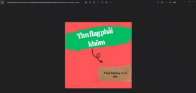
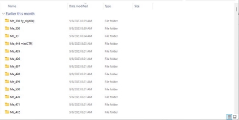
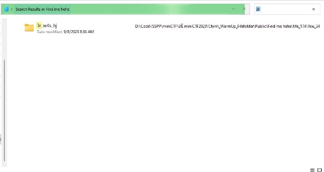
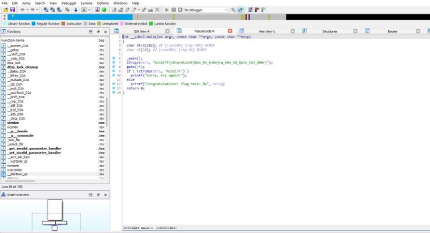

Warm Up 

Base64: 

- File output.txt: bWluaUNURntiNHMzNjRfM25jcnlwdDNkX2J5X2NramQwa30= 
- Đề bài gợi ý là Base64 => dùng tool encode Base64 ra được flag: miniCTF{b4s364\_3ncrypt3d\_by\_ckjd0k} 

INT: 

- Đề bài cho tải về 1 bức ảnh: 

- Nhìn qua bức ảnh thì không thấy gì, tên file có vẻ có gì đó đặc biệt, thử tìm phương thức mã hóa tại[ Decrypt a Message - Cipher Identifier - Online Code Recognizer (dcode.fr) ](https://www.dcode.fr/cipher-identifier)
- Các loại mã hóa có thể được mã hóa đều không ra flag 

- Dùng thử các công cụ[ https://kt.gy/ ](https://kt.gy/)thì may mắn ra được flag: miniCTF{5urpr1se\_y0u\_4re\_4maz1n9!!!} 

FileFolder:

- Đề bài cho một file .rar, tải về và giải nén thấy khá nhiều folder, lướt xem qua thì thấy có 1 vài folder chứa flag 
- Thử sắp xếp lại các folder ở cột date modified:  

- Ta nhận được đầu và cuối của flag là: miniCTF{   6y\_ckjd0k} 
- Đoán được các folder nằm giữa có thể cũng được sửa đi như thế, tìm tương tự với các folder Me\_300, Me\_39, Me\_495, .... 
- Trong folder Me\_300 tìm thêm được đoạn: hjdd3n\_6y 
- Trong folder Me\_39 tìm thêm được đoạn: F{f0ld3r 
- Lướt qua các folder sau ta k thấy mảnh flag nào nên quyết định ghép flag r submit: miniCTF{f0ld3rhjdd3n\_6y\_ckjd0k} 
- Flag bị sai, nghĩa là còn thiếu mảnh nào đó, nhìn các mảnh ta thấy được mảnh này nối với mảnh kia qua 2 kí tự, thử find với 3r 

- Oh sai vài phút ngồi chơi thì ta tìm được mảnh còn sót lại của flag là 3r\_w4s\_hj 
- Đã ra được flag hoàn chỉnh: miniCTF{f0ld3r\_w4s\_hjdd3n\_6y\_ckjd0k} 

String (RE): 

- Đề bài cho 1 file không xác định định dạng file. RE theo thói quen mở lên bằng các tool RE như ida, ghidra,... 
- Chuyển sang mã giả để đọc thì thấy ngay được flag 

Flag: miniCTF{c0nqr4tul4tj0ns\_0n\_kn0wjnq\_h0w\_t0\_0p3n\_tk3\_d00r} 
